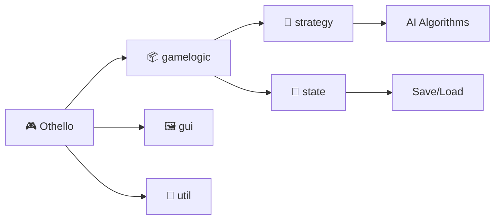

# 🎮 Othello Game with AI

<div align="center">
  
  [](https://www.java.com)
  [](https://openjfx.io/)
  [](https://maven.apache.org/)
  
  **A modern implementation of the classic Othello board game featuring advanced AI strategies**
  
  [🎯 Features](#-features) • 
  [🎮 Play](#-play) • 
  [🤖 AI Strategies](#-ai-strategies) • 
  [📁 Structure](#-structure) • 
  [🧪 Testing](#-testing)

</div>

---

## 🎯 Features

</div>

### ✨ Highlights
- 🖼️ **JavaFX GUI** - Modern, intuitive interface
- 💾 **Save/Load** - Preserve your games
- 🎯 **Smart AI** - Four different difficulty levels
- 🧪 **Well-Tested** - 80%+ code coverage
- 📊 **Real-time Visualization** - See available moves instantly

### 🎮 Play
```bash
# Human vs AI
mvn javafx:run -Djavafx.args="human minimax"

# AI Battle!
mvn javafx:run -Djavafx.args="mcts custom"
```

## 🤖 AI Strategies

<table>
<tr>
<td align="center">
  
### 🧠 Minimax
**Classic game theory**
- Depth: 2 levels
- Assumes perfect play
- Position-based heuristics

</td>
<td align="center">

### 🎲 Expectimax
**Probabilistic approach**
- Models human mistakes
- Chance nodes
- Risk-taking behavior

</td>
</tr>
<tr>
<td align="center">

### 🌲 MCTS
**Advanced exploration**
- 100 iterations/move
- UCT selection
- Random playouts

</td>
<td align="center">

### ⭐ Custom
**Hybrid strategy**
- Corner priority
- Monte Carlo rollouts
- 50 simulations/move

</td>
</tr>
</table>

## 📁 Structure



<details>
<summary>📂 Detailed Structure</summary>

```
othello/
├── 🎯 App.java              # Entry point
├── 📊 Constants.java        # Game constants
├── gamelogic/
│   ├── 🎮 OthelloGame.java  # Core logic
│   ├── 👤 Player.java       # Player types
│   └── strategy/           # AI implementations
├── gui/
│   └── 🖥️ GameController.java
└── util/
    └── 💾 SaveLoadUtil.java
```

</details>

## 🧪 Testing

<div align="center">

| Metric | Status |
|:------:|:------:|
| Coverage |  |
| Tests |  |
| Quality |  |


## 🛠️ Design Patterns

### Strategy Pattern
```java
Strategy → MinimaxStrategy
        → ExpectimaxStrategy
        → MCTSStrategy
        → CustomStrategy
```

### Memento Pattern
```java
OthelloGame → GameMemento → GameHistory
```

## 🎨 Screenshots

<div align="center">

| Game Start | Mid Game | Save/Load |
|:----------:|:--------:|:---------:|
| 🏁 Initial board | 🎯 Available moves | 💾 State management |

</div>

---

## 🧑‍💻 Collaborators

- [@Mingtian Chen](https://github.com/mingtc0702)  
- [@Muqiao Lei](https://github.com/rmurdock41)  
- [@Lingchong Hu](https://github.com/LingchongHu-123)

